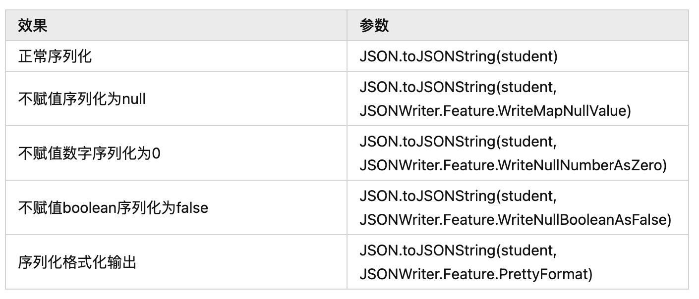

# SpringBoot 整合 fastjson2

# 1. 引入fastJson2依赖

```xml
<!-- pom.xml -->
<dependency>
    <groupId>com.alibaba.fastjson2</groupId>
    <artifactId>fastjson2</artifactId>
    <version>2.0.17</version>
</dependency>
```

# **2. 常用转换**

## **2.1 整理如下**


### **2.2 代码示例**

- 实体类

```java
@Data
@AllArgsConstructor
@NoArgsConstructor
public class Student {

    private String id;

    private String name;

    private Integer age;

    private Date birth;

    private Boolean inSchool;
}
```

- 测试方法

```java
@Test
    void testJson(){
        Student student = new Student("001","小明",12,new Date(),true);
        Student student1 = new Student("002","小红",11,new Date(),true);
        Student student2 = new Student("003","小宋",17,new Date(),false);

        List<Student> students = new ArrayList<>();
        students.add(student);
        students.add(student1);
        students.add(student2);

        Map<String, Student> map = new HashMap<>();
        map.put(student.getId(),student);
        map.put(student1.getId(),student1);
        map.put(student2.getId(),student2);

        // 对象 <--> json
        // JSON.toJSONString() < -- > JSON.parseObject()
        String jsonString = JSON.toJSONString(student);
        System.out.println("对象转json: "+ jsonString);
        System.out.println("对象转json: "+ JSON.parseObject(jsonString,Student.class));

        System.out.println("\n-----------------------------分割线-----------------------\n");

        // List <--> json
        // JSON.toJSONString() < -- > JSON.parseArray()
        String stringFromList = JSON.toJSONString(students);
        System.out.println("List转json: "+ stringFromList);
        System.out.println("json转List: "+ JSON.parseArray(stringFromList,Student.class));

        System.out.println("\n-----------------------------分割线-----------------------\n");

        // Map <--> json
        // JSON.toJSONString() < -- > JSON.parseArray()
        String stringFromMap = JSON.toJSONString(map);
        System.out.println("Map转json: "+ stringFromMap);
        System.out.println("json转Map: "+ JSON.parseObject(stringFromMap,new TypeReference<Map<String,Student>>(){}));

    }
```

- 输出结果：


<font style="color:red">**补充:**</font>

`序列化，从key或者value`

- 代码

```java
    @Test
    void test4(){
        Student student = new Student();
        student.setName("yz");
        String jsonString = JSON.toJSONString(student);
        System.out.println("jsonString = " + jsonString);
        JSONObject object = JSON.parseObject(jsonString);
        System.out.println("name："+object.get("name"));
    }
```

- 输出结果


# **3. 序列化输出参数**

## **3.1 整理如下**



## **3.2 代码示例**

- 测试方法

```java
@Test
    void jsonSeri(){
        // 字符串为null integer为null boolear为null
        Student student = new Student("001",null,null,new Date(),null);
        student.setId("001");
        student.setBirth(new Date());

        System.out.println("正常序列化: "+JSON.toJSONString(student));
        System.out.println("不赋值序列化为null: "+JSON.toJSONString(student, JSONWriter.Feature.WriteMapNullValue));
        System.out.println("不赋值数字序列化为0: "+JSON.toJSONString(student, JSONWriter.Feature.WriteNullNumberAsZero));
        System.out.println("不赋值boolean序列化为false: "+JSON.toJSONString(student, JSONWriter.Feature.WriteNullBooleanAsFalse));
        System.out.println("序列化格式化输出: "+JSON.toJSONString(student, JSONWriter.Feature.PrettyFormat));

    }
```

- 输出结果


# **4. 实体类注解**

## **4.1 整理几个可能用到的**


## **4.2 代码示例**

- 实体类示例

```java
@Data
@AllArgsConstructor
@NoArgsConstructor
@JSONType(orders = {"id","name","age","birth","inSchool"})
public class Student {

    private String id;

    private String name;

    @JSONField(serialize = false)
    private Integer age;

    @JSONField(format = "YYYY-MM-dd")
    private Date birth;

    private Boolean inSchool;
}
```

- 测试代码

```java
@Test
    void test3(){
        Student student = new Student("001","小明",12,new Date(),true);
        System.out.println(
                "日期格式化：YYYY-MM-dd \n"+
                "执行序列化顺序 id name age birth inSchool \n"+
                "年龄不序列化 \n"+
                JSON.toJSONString(student)
        );
    }
```

- 输出结果

