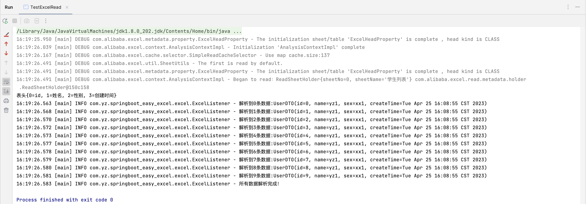

# SpringBoot12 - 整合EasyExcel

---

# **一、Excel导入导出的应用场景**

## **1、数据导入**

减轻录入工作量

## **2、数据导出**

统计信息归档

## **3、数据传输**

异构系统之间数据传输

# **二、EasyExcel简介**

常见excel分析框架：POI、EasyExcel

## **1、官方网站**

[https://github.com/alibaba/easyexcel](https://github.com/alibaba/easyexcel)

快速开始：[https://www.yuque.com/easyexcel/doc/easyexcel](https://www.yuque.com/easyexcel/doc/easyexcel)

## **2、EasyExcel特点**

- Java领域解析、生成Excel比较有名的框架有Apache poi、jxl等。但他们都存在一个严重的问题就是非常的耗内存。如果你的系统并发量不大的话可能还行，但是一旦并发上来后一定会OOM或者JVM频繁的full gc。
- EasyExcel是阿里巴巴开源的一个excel处理框架，**以使用简单、节省内存著称**。EasyExcel能大大减少占用内存的主要原因是在解析Excel时没有将文件数据一次性全部加载到内存中，而是从磁盘上一行行读取数据，逐个解析。
- EasyExcel采用一行一行的解析模式，并将一行的解析结果以观察者的模式通知处理（AnalysisEventListener）。

# 三**、创建项目**

## **1、创建一个普通的maven项目**

项目名：springboot12-easyexcel

## **2、pom中引入xml相关依赖**

```xml
<dependencies>
    <dependency>
        <groupId>com.alibaba</groupId>
        <artifactId>easyexcel</artifactId>
        <version>2.1.7</version>
    </dependency>
    <dependency>
        <groupId>org.slf4j</groupId>
        <artifactId>slf4j-simple</artifactId>
        <version>1.7.5</version>
    </dependency>

    <dependency>
        <groupId>org.apache.xmlbeans</groupId>
        <artifactId>xmlbeans</artifactId>
        <version>3.1.0</version>
    </dependency>

    <dependency>
        <groupId>org.projectlombok</groupId>
        <artifactId>lombok</artifactId>
        <version>1.18.12</version>
    </dependency>
    <dependency>
        <groupId>junit</groupId>
        <artifactId>junit</artifactId>
        <version>4.12</version
    </dependency>

</dependencies>si
```

# **四、写**

## **1、创建实体类**

```java
package com.yz.springboot_easy_excel.pojo.dto;

import com.alibaba.excel.annotation.ExcelProperty;
import lombok.Data;

import java.util.Date;

@Data
public class UserDTO {

    private Integer id;

    @ExcelProperty("姓名")
    private String name;

    @ExcelProperty("性别")
    private String sex;

    @ExcelProperty("创建时间")
    private Date createTime;
}
```

## ****2、最简单的写****

```java
package com.yz.springboot_easy_excel.excel;

import com.alibaba.excel.EasyExcel;
import com.yz.springboot_easy_excel.pojo.dto.UserDTO;

import java.util.ArrayList;
import java.util.Date;
import java.util.List;

public class TestExcelWrite {

    public static void main(String[] args) {
        // 实现excel写操作
        // 1.设置写入文件夹地址和excel文件名称
        String fileName = "/Users/yangzhou/write.xlsx";
        // 2.调用easyExcel里面的方法实现写操作
        // write方法的两个参数：第一个参数文件路径名称，第二个参数实体类的class
        EasyExcel.write(fileName, UserDTO.class).sheet("学生列表").doWrite(getData());

    }

    // 创建方法返回list集合
    private static List<UserDTO> getData(){
        List<UserDTO> list  = new ArrayList<>();
        for (int i = 0; i < 10; i++) {
            UserDTO userDTO = new UserDTO();
            userDTO.setId(i);
            userDTO.setName("yz" + 1);
            userDTO.setSex("xx" + 1);
            userDTO.setCreateTime(new Date());
            list.add(userDTO);
        }
        return list;
    }

}
```

## **3、不同版本的写**

```java
@Test
    public void simpleWriteXls(){
        // 实现excel写操作
        // 1.设置写入文件夹地址和excel文件名称
        String fileName = "/Users/yangzhou/write.xls";
        // 2.调用easyExcel里面的方法实现写操作
        // write方法的两个参数：第一个参数文件路径名称，第二个参数实体类的class
        EasyExcel.write(fileName, UserDTO.class).excelType(ExcelTypeEnum.XLS).sheet("学生列表").doWrite(getData());
    }
```

## **4、写入大数据量**

xls 版本的Excel最多一次可写0 ...65535行

xlsx 版本的Excel最多一次可写0...1048575行

# 五**、读**

## **1、参考文档**

[https://www.yuque.com/easyexcel/doc/read](https://www.yuque.com/easyexcel/doc/read)

## **2、创建监听器**

```java
package com.yz.springboot_easy_excel.excel;

import com.alibaba.excel.context.AnalysisContext;
import com.alibaba.excel.event.AnalysisEventListener;
import com.yz.springboot_easy_excel.pojo.dto.UserDTO;
import lombok.extern.slf4j.Slf4j;

import java.util.Map;

@Slf4j
public class ExcelListener extends AnalysisEventListener<UserDTO> {

    /**
     * 这个每一条数据解析都会来调用
     */
    @Override
    public void invoke(UserDTO userDTO, AnalysisContext analysisContext) {
        log.info("解析到一条数据:{}", userDTO);
    }

    // 读取表头内容
    @Override
    public void invokeHeadMap(Map<Integer, String> headMap, AnalysisContext context) {
        System.out.println("表头" + headMap);
    }

    /**
     * 所有数据解析完成了 都会来调用
     */
    @Override
    public void doAfterAllAnalysed(AnalysisContext analysisContext) {
        log.info("所有数据解析完成！");
    }
}
```

3、测试用例

```java
package com.yz.springboot_easy_excel.excel;

import com.alibaba.excel.EasyExcel;

    public class TestExcelRead {
        public static void main(String[] args) {
            // 实现excel读操作
            // 1.设置读取文件夹地址和excel文件名称
            String fileName = "/Users/yangzhou/write.xlsx";

            EasyExcel.read(fileName, DemoData.class,new ExcelListener()).sheet().doRead();
        }
    }
```

运行结果：



# 六、Excel批量导入

## 1、添加依赖

```xml
    <dependency>
			<groupId>com.alibaba</groupId>
			<artifactId>easyexcel</artifactId>
			<version>2.1.1</version>
		</dependency>

		<dependency>
			<groupId>org.apache.xmlbeans</groupId>
			<artifactId>xmlbeans</artifactId>
			<version>3.1.0</version>
		</dependency>
```

## ****2、创建Excel实体类****

```java
package com.yz.springboot_easy_excel.pojo.dto;

import com.alibaba.excel.annotation.ExcelProperty;
import lombok.Data;

import java.util.Date;

@Data
public class UserDTO {
		@ExcelProperty("id")
    private Integer id;

    @ExcelProperty("姓名")
    private String name;

    @ExcelProperty("性别")
    private String sex;

    @ExcelProperty("创建时间")
    private Date createTime;
}
```

## ****3、创建监听器****

```java
package com.yz.springboot_easy_excel.config.excel_istener;

import com.alibaba.excel.context.AnalysisContext;
import com.alibaba.excel.event.AnalysisEventListener;
import com.yz.springboot_easy_excel.mapper.UserMapper;
import com.yz.springboot_easy_excel.pojo.dto.UserDTO;
import lombok.NoArgsConstructor;
import lombok.extern.slf4j.Slf4j;

import java.util.ArrayList;
import java.util.List;

@Slf4j
@NoArgsConstructor
public class ExcelUserDTOListener extends AnalysisEventListener<UserDTO> {

    /**
     * 每隔5条存储数据库，实际使用中可以3000条，然后清理list，方便内存回收
     */
    private static final int BATCH_COUNT = 5;
    List<UserDTO> list = new ArrayList<UserDTO>();

    private UserMapper userMapper;

    //传入mapper对象
    public ExcelUserDTOListener(UserMapper userMapper) {
        this.userMapper = userMapper;
    }

    /**
     * 遍历每一行记录
     *
     * @param data         用户dto
     * @param context 分析上下文
     */
    @Override
    public void invoke(UserDTO data, AnalysisContext context) {
        log.info("解析到一条记录：{}",data);
        list.add(data);
        // 达到BATCH_COUNT了，需要去存储一次数据库，放置数据几万条数据在内存，容易OOM
        if (list.size() > BATCH_COUNT) {
            saveData();
            // 存储完毕清理 list
            list.clear();
        }
    }

    /**
     * 所有数据解析完成了 都来调用
     *
     * @param analysisContext 分析上下文
     */
    @Override
    public void doAfterAllAnalysed(AnalysisContext analysisContext) {
        // 这里也要保存数据，确保最后遗留的数据也存储到数据库
        saveData();
        log.info("所有数据解析完成！");
    }

    /**
     * 加入存储数据库
     */
    private void saveData() {

        log.info("{}条数据，开始存储数据库！",list.size());
        userMapper.insertBatch(list);//批量插入
        log.info("存储数据库成功！");

    }
}
```

## **4、Mapper层批量插入**

接口：UserMapper

```java
package com.yz.springboot_easy_excel.mapper;

import com.baomidou.mybatisplus.core.mapper.BaseMapper;
import com.yz.springboot_easy_excel.pojo.User;
import com.yz.springboot_easy_excel.pojo.dto.UserDTO;
import org.apache.ibatis.annotations.Mapper;

import java.util.List;

/**
* @author yangzhou
* @description 针对表【user】的数据库操作Mapper
* @createDate 2023-04-25 15:36:10
* @Entity springboot_easy_excel.pojo.User
*/
@Mapper
public interface UserMapper extends BaseMapper<User> {

    void insertBatch(List<UserDTO> list);
}
```

xml：UserMapper.xml

```xml
<insert id="insertBatch" parameterType="com.yz.springboot_easy_excel.pojo.dto.UserDTO">
        insert into user(
            id,name,sex
        )values
        <foreach collection="list" item="item" index="index" separator=",">
            (
            #{item.id} ,
            #{item.name} ,
            #{item.sex}
            )
        </foreach>
    </insert>
```

## **5、Service层创建监听器实例**

接口 UserService

```java
package com.yz.springboot_easy_excel.service;

import com.baomidou.mybatisplus.extension.service.IService;
import com.yz.springboot_easy_excel.pojo.User;
import com.yz.springboot_easy_excel.pojo.dto.UserDTO;

import java.io.InputStream;
import java.util.List;

/**
* @author yangzhou
* @description 针对表【user】的数据库操作Service
* @createDate 2023-04-25 15:36:10
*/
public interface UserService extends IService<User> {
    /**
     * 导入数据
     *
     * @param inputStream 输入流
     */
    void importData(InputStream inputStream);
}
```

实现：UserServiceImpl
注意：此处添加了事务处理，默认情况下rollbackFor = RuntimeException.class

```java
package com.yz.springboot_easy_excel.service.impl;

import com.alibaba.excel.EasyExcel;
import com.baomidou.mybatisplus.extension.service.impl.ServiceImpl;
import com.yz.springboot_easy_excel.config.excel_istener.ExcelUserDTOListener;
import com.yz.springboot_easy_excel.mapper.UserMapper;
import com.yz.springboot_easy_excel.pojo.User;
import com.yz.springboot_easy_excel.pojo.dto.UserDTO;
import com.yz.springboot_easy_excel.service.UserService;
import lombok.extern.slf4j.Slf4j;
import org.springframework.beans.BeanUtils;
import org.springframework.stereotype.Service;
import org.springframework.transaction.annotation.Transactional;

import java.io.InputStream;
import java.util.ArrayList;
import java.util.List;

/**
* @author yangzhou
* @description 针对表【user】的数据库操作Service实现
* @createDate 2023-04-25 15:36:10
*/
@Service
@Slf4j
public class UserServiceImpl extends ServiceImpl<UserMapper, User>
    implements UserService {

    /**
     * 导入数据
     *
     * @param inputStream 输入流
     */
    @Transactional(rollbackFor = {Exception.class})
    @Override
    public void importData(InputStream inputStream) {
        // 这里 需要指定读用哪个class去读，然后读取第一个sheet 文件流会自动关闭
        EasyExcel.read(inputStream, UserDTO.class, new ExcelUserDTOListener(baseMapper)).sheet().doRead();
        log.info("importData finished");
    }
}
```

## ****6、Controller层接收客户端上传****

UserController

```java
package com.yz.springboot_easy_excel.controller;

import com.alibaba.excel.EasyExcel;
import com.sun.deploy.net.URLEncoder;
import com.yz.springboot_easy_excel.config.exception.CustomException;
import com.yz.springboot_easy_excel.pojo.dto.UserDTO;
import com.yz.springboot_easy_excel.service.UserService;
import com.yz.springboot_easy_excel.utils.ResponseEnum;
import com.yz.springboot_easy_excel.utils.Result;
import lombok.extern.slf4j.Slf4j;
import org.springframework.beans.factory.annotation.Autowired;
import org.springframework.web.bind.annotation.*;
import org.springframework.web.multipart.MultipartFile;

import javax.servlet.http.HttpServletResponse;
import java.io.IOException;
import java.io.InputStream;

@RestController
@RequestMapping("/user")
@Slf4j
public class UserController {

    @Autowired
    private UserService userService;

    @PostMapping("/import")
    public Result batchImport(
        @RequestParam("file") MultipartFile file) {

        try {
            InputStream inputStream = file.getInputStream();
            userService.importData(inputStream);
            return Result.ok().message("批量导入成功");
        } catch (Exception e) {
            throw new CustomException(-103,"文件上传失败");
        }
    }

}
```

## **7、添加mapper发布配置**

注意：因为maven工程在默认情况下src/main/java目录下的所有资源文件是不发布到target目录下的，因此我们需要在pom.xml中添加xml配置文件发布配置

```xml
<build>
		<!-- 项目打包时会将java目录中的*.xml文件也进行打包 -->
		<resources>
			<resource>
				<directory>src/main/java</directory>
				<includes>
					<include>**/*.xml</include>
				</includes>
				<filtering>false</filtering>
			</resource>
		</resources>
	</build>
```

# 七、Excel批量导出

## **1、Service层解析Excel数据**

接口：UserService

```java
package com.yz.springboot_easy_excel.service;

import com.baomidou.mybatisplus.extension.service.IService;
import com.yz.springboot_easy_excel.pojo.User;
import com.yz.springboot_easy_excel.pojo.dto.UserDTO;

import java.io.InputStream;
import java.util.List;

/**
* @author yangzhou
* @description 针对表【user】的数据库操作Service
* @createDate 2023-04-25 15:36:10
*/
public interface UserService extends IService<User> {

    /**
     * 导出数据
     *
     * @return {@link List}<{@link UserDTO}>
     */
    List<UserDTO> listUserDTOData();
}
```

实现：DictServiceImpl

```java
package com.yz.springboot_easy_excel.service.impl;

import com.alibaba.excel.EasyExcel;
import com.baomidou.mybatisplus.extension.service.impl.ServiceImpl;
import com.yz.springboot_easy_excel.config.excel_istener.ExcelUserDTOListener;
import com.yz.springboot_easy_excel.mapper.UserMapper;
import com.yz.springboot_easy_excel.pojo.User;
import com.yz.springboot_easy_excel.pojo.dto.UserDTO;
import com.yz.springboot_easy_excel.service.UserService;
import lombok.extern.slf4j.Slf4j;
import org.springframework.beans.BeanUtils;
import org.springframework.stereotype.Service;
import org.springframework.transaction.annotation.Transactional;

import java.io.InputStream;
import java.util.ArrayList;
import java.util.List;

/**
* @author yangzhou
* @description 针对表【user】的数据库操作Service实现
* @createDate 2023-04-25 15:36:10
*/
@Service
@Slf4j
public class UserServiceImpl extends ServiceImpl<UserMapper, User>
    implements UserService {

    /**
     * 导出数据
     *
     * @return {@link List}<{@link UserDTO}>
     */
    @Override
    public List<UserDTO> listUserDTOData() {

        List<User> list = baseMapper.selectList(null);
        //创建ExcelDictDTO列表，将Dict列表转换成ExcelDictDTO列表
        ArrayList<UserDTO> excelUserDTOArrayList = new ArrayList<>(list.size());
        list.forEach(user -> {
            UserDTO userDTO = new UserDTO();
            BeanUtils.copyProperties(user,userDTO);
            excelUserDTOArrayList.add(userDTO);

        });

        return excelUserDTOArrayList;
    }
}
```

## ****2、Controller层接收客户端请求****

```java
package com.yz.springboot_easy_excel.controller;

import com.alibaba.excel.EasyExcel;
import com.sun.deploy.net.URLEncoder;
import com.yz.springboot_easy_excel.config.exception.CustomException;
import com.yz.springboot_easy_excel.pojo.dto.UserDTO;
import com.yz.springboot_easy_excel.service.UserService;
import com.yz.springboot_easy_excel.utils.ResponseEnum;
import com.yz.springboot_easy_excel.utils.Result;
import lombok.extern.slf4j.Slf4j;
import org.springframework.beans.factory.annotation.Autowired;
import org.springframework.web.bind.annotation.*;
import org.springframework.web.multipart.MultipartFile;

import javax.servlet.http.HttpServletResponse;
import java.io.IOException;
import java.io.InputStream;

@RestController
@RequestMapping("/user")
@Slf4j
public class UserController {

    @Autowired
    private UserService userService;

    @GetMapping("/export")
    public void export(HttpServletResponse response){

        try {
            response.setContentType("application/vnd.ms-excel");
            response.setCharacterEncoding("utf-8");
            // 这里URLEncoder.encode可以防止中文乱码 当然和EasyExcel没有关系
            String fileName = URLEncoder.encode("mydict", "UTF-8").replaceAll("\\+", "%20");
            response.setHeader("Content-disposition", "attachment;filename*=utf-8''" + fileName + ".xlsx");
            EasyExcel.write(response.getOutputStream(), UserDTO.class).sheet("学生列表").doWrite(userService.listUserDTOData());

        } catch (IOException e) {
            //EXPORT_DATA_ERROR(104, "数据导出失败"),
            throw  new CustomException(ResponseEnum.EXPORT_DATA_ERROR,e);
        }
    }

}
```